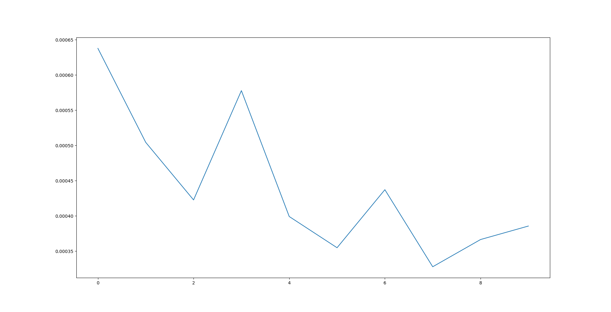
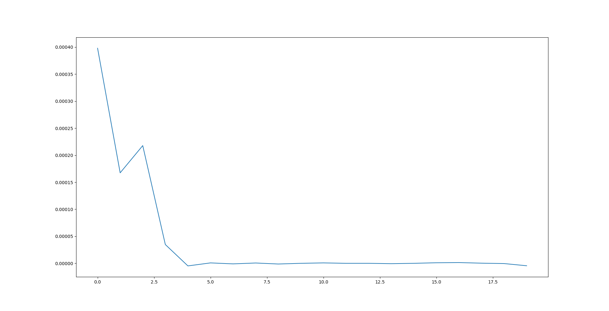

# lung_cancer_survival_time
## Quick-Start
Run
```python
python model.py
```
for method 1, and 
```python
python cnn_based_model.py
```
for method 2.
## Work done
For this challenge my goal was to build a model using the images and the masks. I first built a model using a CoxPH Fitter, with the data from clinicals.csv and radiomics.csv. 
I then built a CNN based model, learning from the clinicals, radiomics, and the images, with a coxPH loss function (based on the DeepSurv model).
### Model.py (Python Lifelines)
This model first takes the data, transforms it into dummy variables, then uses the CoxPHFitter from the lifelines library in python. It achieves a c-index of 0.74 for the train set, and about 0.64 for the validation set (overfitting).
It could be improved through features selection with a correlation matrix or other methods, and data normalization.
Most of the time for this challenge was spent on the second method.

### Cnn_based_model.py (Python Keras)
This model is a multi-input neural network, taking the clinicals, radiomics as well as the scans. The first two are passed into a few Dense layers, using BatchNormalization and Dropout. The scans are passed into a ResNet50. We use a pre-trained model to balance the fact that the dataset is so small.
More than the time-to-event, the model predicts for now the hazard ratio, trying to maximize the Cox Proportional Hazard Model equation.
However if this model does indeed learn (as we can see in the figures below), it doesen't output satisfying variables, with a hazard-ratio of 1.0 for each input after 20 epochs.


Model using radiomics+scans after 10 epochs

Model using radiomics+scans+clinicals after 20 epoch

This model could mostly be improved by a better implementation of the cox loss function.
